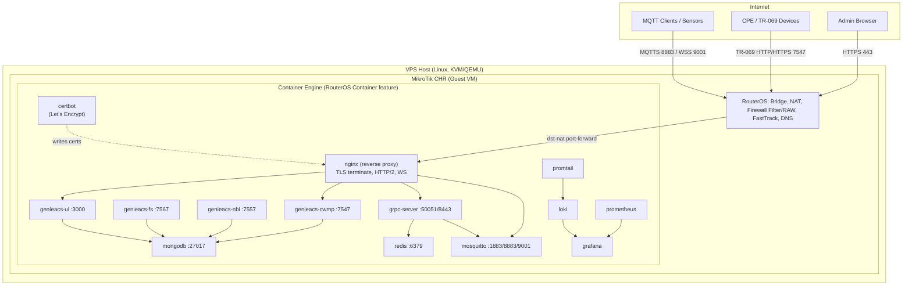

# 01 — System Architecture

## Overview

Sistem TR-069/GenieACS berjalan sepenuhnya sebagai **container di dalam MikroTik CHR**, yang sendiri berjalan sebagai VM (guest) di atas VPS Linux (host/hypervisor). Pendekatan ini memberi:

- **Isolasi jaringan native** lewat RouterOS firewall/NAT sebelum trafik menyentuh container manapun.
- **Satu titik kontrol** (CHR) untuk routing, firewall, dan container lifecycle — cocok untuk skenario ISP/TR-069 yang memang sudah lekat dengan MikroTik.
- **Portabilitas**: seluruh stack (compose reference) tetap bisa dipindah ke Docker/Kubernetes murni jika suatu saat CHR container dianggap membatasi skala.

## Layered Architecture

## Design Principles

1. **Single public ingress**: hanya `nginx` yang punya rute keluar dari MikroTik (via dst-nat). Semua service lain — MongoDB, Redis, GenieACS NBI/FS internal — **tidak pernah** di-expose langsung ke internet.
2. **Defense in depth**: RouterOS firewall (filter + raw) → Nginx security headers & rate-limit → container-level (non-root, read-only fs) → application-level auth (JWT/API key/MQTT ACL).
3. **Service discovery by name**: semua container berada di satu Docker network (`container-network`) dan saling memanggil lewat DNS internal Docker (`mongodb:27017`, dst), tidak pernah pakai IP statis.
4. **Stateless where possible**: `grpc-server` dan `nginx` stateless, gampang di-scale horizontal; state hidup di `mongodb`, `redis`, dan `mosquitto` (persistent volume).
5. **Observability built-in**: setiap container mengirim log ke Loki (via Promtail/driver) dan metrik ke Prometheus sejak hari pertama, bukan ditambahkan belakangan.

## Kenapa CHR + Container (bukan VPS + Docker langsung)?

| Aspek | CHR + Container | VPS + Docker langsung |
|---|---|---|
| Kontrol trafik ISP-grade (queue, PPPoE, hotspot, VPN) | Native RouterOS | Perlu tooling tambahan |
| Firewall/NAT granular | RouterOS filter+raw, sangat matang | iptables/nftables manual |
| Familiar untuk tim yang sudah pakai MikroTik | Ya | Perlu belajar stack baru |
| Kematangan ekosistem container | Terbatas (RouterOS container masih baru, single network interface per container secara native) | Penuh (Docker Compose/K8s) |
| Rekomendasi | Cocok kalau CHR memang jadi router utama/edge | Cocok kalau container adalah fokus utama |

> **Catatan penting**: RouterOS container feature (sejak v7.x) berjalan di atas container engine internal (bukan Docker Engine penuh) dan **satu container = satu veth interface**, tidak ada Docker Compose native. Karena itu dokumen ini menyediakan **docker-compose.reference.yml** sebagai referensi arsitektur/dependency graph, sementara deployment sesungguhnya ke CHR dilakukan per-container lewat `/container add` (lihat `mikrotik/routeros-chr.rsc`). Untuk kemudahan maintenance jangka panjang, opsi yang lebih matang secara operasional adalah menjalankan Docker Engine di **host VPS Linux**, dan CHR hanya berperan sebagai **router/firewall edge di depan host** (trafik masuk → CHR filter/NAT → forward ke Docker bridge di host). Kedua topologi dijelaskan di `docs/11-deployment-recommendations.md`; RouterOS container tetap didukung penuh untuk kasus di mana isolasi total dalam satu VM CHR memang menjadi requirement.
