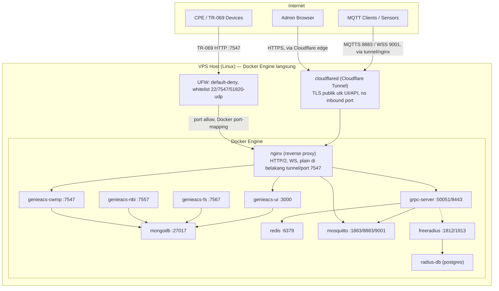

# 01 — System Architecture

## Overview

Sistem TR-069/GenieACS berjalan sebagai **Docker Compose langsung di host
VPS Linux** — tidak ada MikroTik CHR/RouterOS di jalur manapun (hypervisor
VPS tidak meng-expose nested virtualization/KVM, jadi CHR tidak bisa
dijalankan; detail di `docs/11-deployment-recommendations.md` dan
`docs/12-wireguard-vpn.md`). Pendekatan ini memberi:

- **Firewall host native** (UFW, default-deny) sebelum trafik menyentuh container manapun.
- **Satu titik kontrol** (Docker Engine di host) untuk container lifecycle, tanpa layer virtualisasi ekstra.
- **Jalur admin/privat terpisah** lewat WireGuard (`wg0`) — bukan bagian dari trafik publik, lihat `docs/15-alur-akses-wireguard.md`.

## Layered Architecture

> Monitoring (Prometheus/Grafana/Loki/Promtail) sengaja tidak digambar di
> jalur utama — stack ini opsional (`profiles: ["monitoring"]` di
> `docker-compose.reference.yml`), off by default karena footprint RAM-nya
> signifikan dibanding kapasitas VPS. Lihat `docs/09-monitoring.md`.

## Design Principles

1. **Single public ingress per jalur**: `nginx` (via Cloudflare Tunnel untuk UI/API, via UFW port `7547` langsung untuk CWMP) adalah satu-satunya titik masuk trafik publik. Semua service lain — MongoDB, Redis, GenieACS NBI/FS internal, FreeRADIUS — **tidak pernah** di-expose langsung ke internet.
2. **Defense in depth**: UFW (host, default-deny) → Cloudflare edge (untuk domain yang lewat tunnel) → Nginx security headers & rate-limit → container-level (non-root, read-only fs) → application-level auth (JWT/API key/MQTT ACL).
3. **Service discovery by name, network tersegmentasi**: container terbagi ke beberapa Docker network sesuai trust zone (`edge-net`, `app-net`, `data-net`, `obs-net`, `radius-net` — lihat `docs/05-container-topology.md`), saling memanggil lewat DNS internal Docker, tidak pernah pakai IP statis.
4. **Stateless where possible**: `grpc-server` dan `nginx` stateless, gampang di-scale horizontal; state hidup di `mongodb`, `redis`, `mosquitto`, dan `radius-db` (persistent volume).
5. **Observability opsional, bukan wajib**: Loki/Prometheus/Grafana tersedia sebagai profile terpisah, diaktifkan kalau resource VPS memungkinkan — bukan diasumsikan selalu jalan sejak hari pertama.
