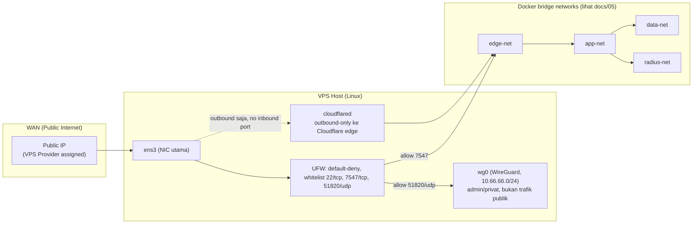

# 02 — Network Diagram

## Physical / Virtual Network Layers

Tidak ada MikroTik CHR/RouterOS di jalur ini — VPS Host langsung menjalankan
Docker Engine, firewall edge ditangani UFW di level host Linux. Lihat
`docs/01-architecture.md` untuk alasan kenapa CHR tidak dipakai, dan
`docs/05-container-topology.md` untuk diagram Docker bridge network secara
detail (`edge-net`/`app-net`/`data-net`/`obs-net`/`radius-net`).

## IP Addressing Plan

| Segment | CIDR | Keterangan |
|---|---|---|
| WAN (`ens3`) | dari provider VPS | Public IP VPS, satu-satunya interface yang "terlihat" dari internet |
| WireGuard (`wg0`) | `10.66.66.0/24` | Hub-and-spoke akses admin/privat — lihat `docs/12-wireguard-vpn.md` |
| Docker bridge networks | subnet auto-assign per network (`edge-net`, `app-net`, `data-net`, `obs-net`, `radius-net`) | Nama service dipakai untuk resolusi DNS internal Docker, IP cuma referensi — lihat `docs/05` untuk daftar lengkap container per network |

> Container **tidak** diberi IP publik langsung. Jalur masuk dari WAN cuma
> dua: (1) UFW port-mapping Docker `7547 -> nginx:7547` untuk CWMP (sebagian
> CPE butuh koneksi langsung tanpa TLS/SNI — lihat `docs/04-tr069-request-flow.md`),
> dan (2) Cloudflare Tunnel (outbound-only dari host, tidak ada port
> inbound tambahan) untuk domain UI/API.

## Port Map (Publik → Internal)

| Port Publik | Protokol | Diteruskan ke | Keterangan |
|---|---|---|---|
| 7547/tcp | HTTP (TR-069) | UFW allow → Docker port-map → nginx:7547 → genieacs-cwmp | Satu-satunya port CWMP publik langsung, untuk CPE yang tidak lewat Cloudflare |
| 51820/udp | WireGuard | UFW allow → `wg0` | Akses admin/privat, bukan trafik produksi |
| 22/tcp | SSH | UFW allow, key-based auth only, `fail2ban` aktif | Manajemen host VPS |
| — (tanpa port publik) | HTTPS | Cloudflare Tunnel → nginx:80 → genieacs-ui/grpc-server/dst. | `acs`, `api`, `fs.obc-crypto.com` — TLS publik ditangani Cloudflare edge |

Seluruh port lain (27017, 6379, 1883, 3000, 50051, 8443, dst) **hanya listen di jaringan internal Docker**, tidak pernah di-dst-nat ke WAN.
