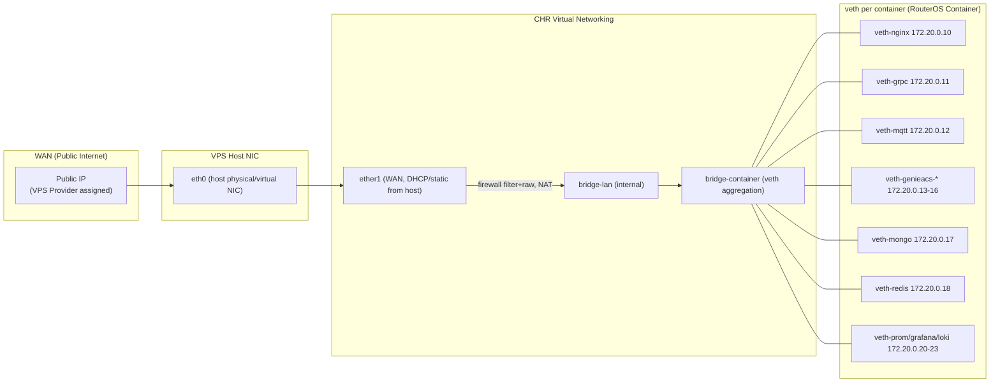

# 02 — Network Diagram

## Physical / Virtual Network Layers

## IP Addressing Plan

| Segment | CIDR | Keterangan |
|---|---|---|
| WAN (ether1) | dari provider VPS | Public IP VPS, satu-satunya interface yang "terlihat" dari internet |
| bridge-lan | 192.168.88.0/24 | Manajemen RouterOS, akses admin (winbox/ssh) dibatasi IP tertentu |
| bridge-container | 172.20.0.0/24 | Segment khusus veth container, **tidak di-NAT keluar kecuali lewat masquerade terkontrol** |
| Docker internal (`container-network`) | 172.28.0.0/24 (jika host-Docker) | Nama service dipakai untuk resolusi, IP hanya untuk referensi diagram |

> Container **tidak** diberi IP publik langsung. Satu-satunya jalur masuk dari WAN adalah dst-nat `ether1 -> veth-nginx:443` (dan `:7547` untuk TR-069 jika CPE butuh koneksi langsung tanpa TLS SNI routing — lihat catatan di `docs/04-tr069-request-flow.md`).

## Port Map (Publik → Internal)

| Port Publik | Protokol | Diteruskan ke | Keterangan |
|---|---|---|---|
| 443/tcp | HTTPS/HTTP2/WSS | nginx:443 | Satu-satunya entrypoint utama, SNI routing ke semua subdomain |
| 7547/tcp | HTTP/HTTPS (TR-069) | nginx → genieacs-cwmp:7547 | Sebagian ACS/CPE tidak support SNI, port ini opsional dibuka langsung |
| 80/tcp | HTTP | nginx:80 | Hanya untuk ACME HTTP-01 challenge + redirect ke 443 |
| 22/tcp | SSH | dibatasi source-address list `admin-allowed` | Manajemen RouterOS |

Seluruh port lain (27017, 6379, 1883, 3000, 50051, 9090, 3100, 3001, dst) **hanya listen di jaringan internal container**, tidak pernah di-dst-nat ke WAN.
