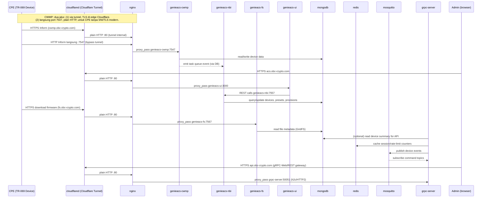

# 03 — Diagram Komunikasi Antar Service

Tidak ada port `443` yang di-publish di deployment ini — TLS publik untuk
domain UI/API/CWMP ditangani **Cloudflare Tunnel** (`cloudflared`, outbound-only,
nginx cukup plain HTTP `:80` di baliknya), kecuali CWMP yang juga punya jalur
kedua langsung ke port `7547` (untuk CPE lawas tanpa SNI/TLS modern). Lihat
`docs/02-network-diagram.md` untuk port map lengkap.

## Matriks Komunikasi (siapa boleh bicara ke siapa)

| From \ To | nginx | genieacs-cwmp | genieacs-nbi | genieacs-fs | genieacs-ui | mongodb | redis | mosquitto | grpc-server | prometheus |
|---|---|---|---|---|---|---|---|---|---|---|
| Internet | ✅ via `cloudflared` (outbound-only tunnel, `:80` internal) + `:7547` langsung (UFW allow) | ❌ | ❌ | ❌ | ❌ | ❌ | ❌ | ❌ | ❌ | ❌ |
| nginx | - | ✅ | ✅ | ✅ | ✅ | ❌ | ❌ | ✅ (WS) | ✅ | ✅ (opsional, dashboard internal) |
| genieacs-cwmp/nbi/fs/ui | ❌ | - | - | - | - | ✅ | ❌ | ❌ | ❌ | - |
| grpc-server | ❌ | ❌ | ✅ (opsional, integrasi) | ❌ | ❌ | ✅ (opsional) | ✅ | ✅ | - | - |
| prometheus | ❌ | scrape :9100/metrics | scrape | scrape | scrape | exporter | exporter | exporter | scrape /metrics | - |
| promtail | membaca log lokal semua container (docker socket/log driver) → forward ke loki | | | | | | | | | |

> Baris `prometheus`/`promtail` menggambarkan desain **kalau** profile
> `monitoring` diaktifkan (off by default di VPS ini, lihat
> `docs/09-monitoring.md`) — exporter yang disebut (nginx-exporter,
> mongodb-exporter, dst.) belum ada di `docker-compose.reference.yml` saat ini.

Prinsip **zero trust antar container**: hubungan di atas tidak otomatis "boleh" hanya karena satu Docker network — tetap ditegakkan lewat:
- Docker network internal terpisah (`data-net` untuk mongodb/redis, `edge-net` untuk nginx↔service publik, `app-net` untuk service aplikasi, `radius-net` untuk freeradius/radius-db — tidak semua container ikut semua network, lihat `docs/05-container-topology.md`).
- Autentikasi wajib di setiap service (Mongo auth, Redis `requirepass`, Mosquitto user/ACL, gRPC JWT + internal API key, GenieACS NBI dibatasi hanya diakses dari `genieacs-ui`/`grpc-server` via network policy, bukan lewat publik).
