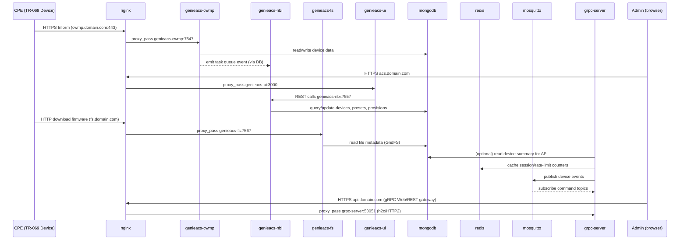

# 03 — Diagram Komunikasi Antar Service

## Matriks Komunikasi (siapa boleh bicara ke siapa)

| From \ To | nginx | genieacs-cwmp | genieacs-nbi | genieacs-fs | genieacs-ui | mongodb | redis | mosquitto | grpc-server | prometheus |
|---|---|---|---|---|---|---|---|---|---|---|
| Internet | ✅ (443,80,7547) | ❌ | ❌ | ❌ | ❌ | ❌ | ❌ | ❌ | ❌ | ❌ |
| nginx | - | ✅ | ✅ | ✅ | ✅ | ❌ | ❌ | ✅ (WS) | ✅ | ✅ (opsional, dashboard internal) |
| genieacs-cwmp/nbi/fs/ui | ❌ | - | - | - | - | ✅ | ❌ | ❌ | ❌ | - |
| grpc-server | ❌ | ❌ | ✅ (opsional, integrasi) | ❌ | ❌ | ✅ (opsional) | ✅ | ✅ | - | - |
| prometheus | ❌ | scrape :9100/metrics | scrape | scrape | scrape | exporter | exporter | exporter | scrape /metrics | - |
| promtail | membaca log lokal semua container (docker socket/log driver) → forward ke loki | | | | | | | | | |

Prinsip **zero trust antar container**: hubungan di atas tidak otomatis "boleh" hanya karena satu Docker network — tetap ditegakkan lewat:
- Docker network internal terpisah (`db-net` untuk mongodb/redis, `edge-net` untuk nginx↔service, tidak semua container ikut semua network).
- Autentikasi wajib di setiap service (Mongo auth, Redis `requirepass`, Mosquitto user/ACL, gRPC JWT + internal API key, GenieACS NBI dibatasi hanya diakses dari `genieacs-ui`/`grpc-server` via network policy, bukan lewat publik).
