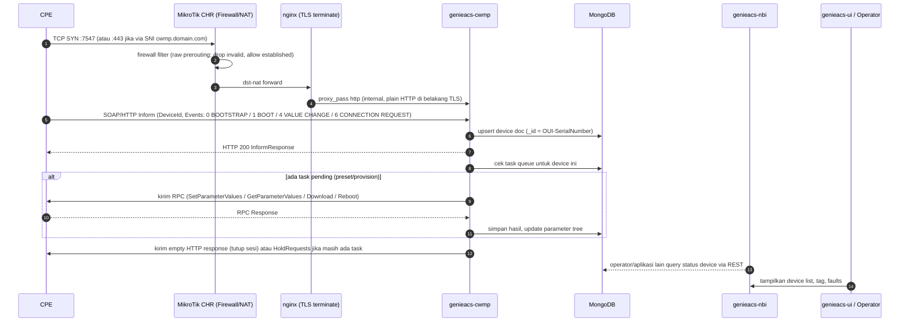
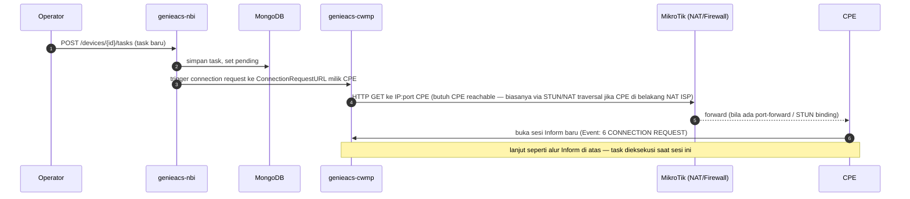
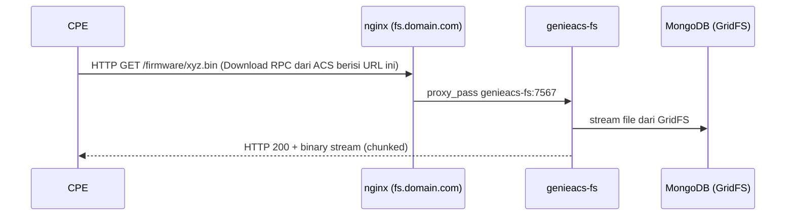

# 04 — Diagram Alur Request TR-069

## Alur Inform standar (CPE → ACS)

## Alur Connection Request (ACS → CPE, untuk trigger instan)

## Firmware / File Download (genieacs-fs)

## Catatan Desain

- **TR-069 (CWMP)** = protokol transport/RPC dasar. **TR-098** (InternetGatewayDevice) dan **TR-181** (Device:2 data model) adalah *skema data model* di atas CWMP — GenieACS mendukung keduanya secara otomatis berdasarkan data model yang dikirim CPE saat Inform.
- **Virtual Parameter** dipakai untuk expose nilai turunan (mis. gabungan RSSI dari beberapa parameter) tanpa mengubah data model asli — didefinisikan sebagai script JS kecil di GenieACS UI, dieksekusi oleh `genieacs-cwmp`.
- **Preset** = aturan otomatis "jika device match filter X, terapkan konfigurasi Y" — dievaluasi setiap Inform masuk.
- **Provision** = script JS yang benar-benar dieksekusi (preset memanggil provision).
- Kalau banyak CPE di belakang NAT berlapis (ISP-grade), **Connection Request langsung sering gagal** — mitigasi: gunakan **periodic inform interval pendek** (mis. 300s) atau **STUN** (`genieacs-cwmp` mendukung STUN client hint dari CPE), atau **XMPP/MQTT wake-up** kalau CPE mendukung TR-069 Annex K (di luar scope default GenieACS, butuh custom bridge — inilah salah satu use case `grpc-server` + `mosquitto` di arsitektur ini: menerima event dari sistem lain lalu memicu connection-request via NBI API).
