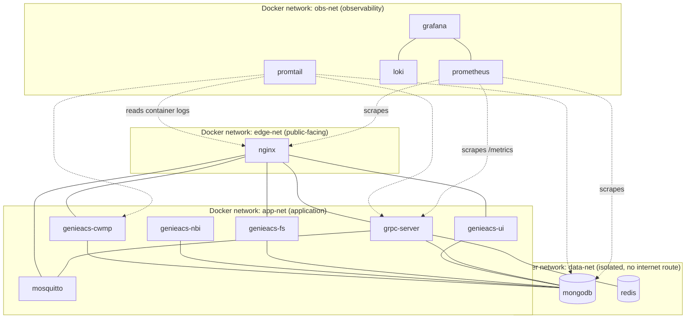

# 05 — Topologi Container

## Container Bridge Membership

| Container | edge-net | app-net | data-net | obs-net | Publish Port ke Host |
|---|:-:|:-:|:-:|:-:|---|
| nginx | ✅ | ✅ | ❌ | ❌ | 7547 (80/443 tidak di-publish — TLS domain UI/API ditangani Cloudflare Tunnel, lihat `docs/06`) |
| grpc-server | ❌ | ✅ | ✅ (khusus redis/mongo) | ✅ (expose /metrics) | tidak ada (internal only) |
| mosquitto | ❌ | ✅ | ❌ | ✅ | tidak ada (diakses via nginx WS proxy) |
| genieacs-cwmp | ❌ | ✅ | ✅ | ✅ | tidak ada |
| genieacs-nbi | ❌ | ✅ | ✅ | ✅ | tidak ada |
| genieacs-fs | ❌ | ✅ | ✅ | ✅ | tidak ada |
| genieacs-ui | ❌ | ✅ | ✅ | ✅ | tidak ada |
| mongodb | ❌ | ❌ | ✅ | ✅ (exporter) | tidak ada |
| redis | ❌ | ❌ | ✅ | ✅ (exporter) | tidak ada |
| prometheus/grafana/loki/promtail | ❌ | ❌ | ❌ | ✅ | grafana saja, via nginx (auth) |

> Kunci desain: `mongodb` dan `redis` **hanya** ada di `data-net`, tidak pernah tergabung ke `edge-net`. Kalaupun `nginx` di-compromise, penyerang tidak bisa langsung route ke database — harus lewat `grpc-server`/`genieacs-*` yang punya layer auth sendiri.

## Resource Sizing (rekomendasi awal, VPS 4 vCPU / 8GB RAM)

| Container | CPU limit | Memory limit | Catatan |
|---|---|---|---|
| nginx | 0.5 | 128Mi | ringan, I/O bound |
| grpc-server | 0.5 | 128Mi | Go binary, footprint kecil |
| mosquitto | 0.3 | 64Mi | |
| genieacs-cwmp | 1.0 | 512Mi | proses paling sibuk saat banyak CPE inform bersamaan |
| genieacs-nbi | 0.5 | 256Mi | |
| genieacs-fs | 0.3 | 128Mi | |
| genieacs-ui | 0.3 | 256Mi | Node.js |
| mongodb | 1.5 | 2Gi | sisihkan RAM untuk WiredTiger cache |
| redis | 0.3 | 256Mi | |
| prometheus | 0.5 | 512Mi | retensi disesuaikan (mis. 15 hari) |
| grafana | 0.3 | 256Mi | |
| loki + promtail | 0.5 | 512Mi | |

Total kira-kira ~6 vCPU (burstable) / ~5Gi RAM baseline — sisakan headroom untuk lonjakan saat mass-inform (mis. setelah outage listrik area, ribuan CPE reconnect bersamaan).
