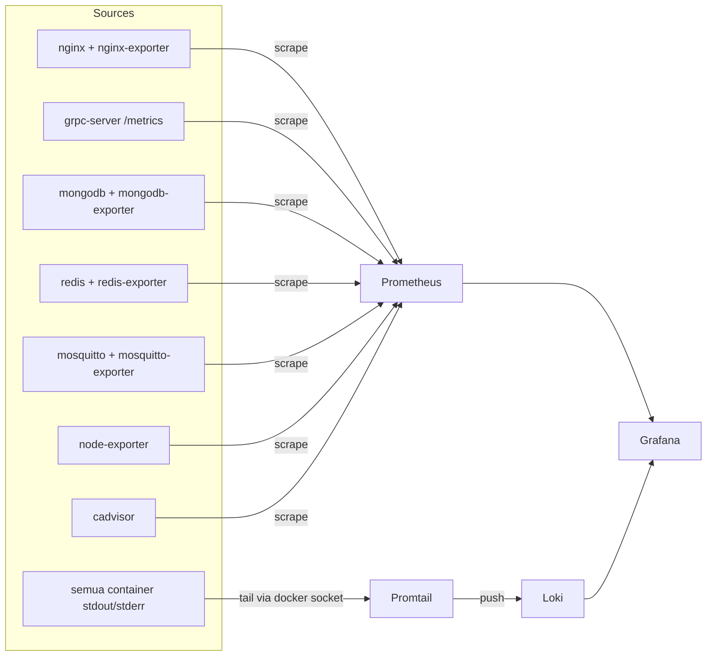

# 09 — Monitoring

## Status: opsional, off by default

Stack ini **tidak jalan by default** di VPS ini — di `docker-compose.reference.yml`
ke-4 service (`prometheus`, `grafana`, `loki`, `promtail`) ada di belakang
`profiles: ["monitoring"]`, baru aktif kalau eksplisit `./deploy.sh --monitoring`.
Alasan: footprint RAM-nya (~500MB–950MB) signifikan dibanding kapasitas VPS
(2 vCPU/1.9GB) — lihat catatan resource sizing di `docs/05-container-topology.md`.

**Penting**: exporter yang disebut di dokumen ini (`nginx-exporter`,
`mongodb-exporter`, `redis-exporter`, `mosquitto-exporter`, `node-exporter`,
`cadvisor`) adalah **desain target, belum ada satupun di
`docker-compose.reference.yml`** saat ini — cuma 4 base image
(prometheus/grafana/loki/promtail) yang benar-benar terdefinisi. Kalau
mengaktifkan profile `monitoring`, exporter-exporter ini masih perlu
ditambahkan manual sebagai service baru sebelum metrik di bawah benar-benar
terisi.

## Stack
Prometheus (metrics) + Grafana (visualisasi) + Loki/Promtail (log terpusat).

## Yang Dimonitor

| Kategori | Metrik Kunci | Sumber |
|---|---|---|
| CPU/RAM per container | `container_cpu_usage_seconds_total`, `container_memory_usage_bytes` | cadvisor |
| Host CPU/RAM/Disk/Network | `node_cpu_seconds_total`, `node_memory_*`, `node_network_*` | node-exporter |
| gRPC | `grpc_server_requests_total`, `grpc_server_request_duration_seconds` | grpc-server `/metrics` (custom, lihat `internal/middleware/metrics.go`) |
| Nginx | request rate, status code distribution, upstream latency | nginx-exporter (stub_status) |
| MongoDB | ops/sec, connections, replication lag, cache hit ratio | mongodb_exporter |
| Redis | memory usage, hit/miss ratio, connected clients | redis_exporter |
| MQTT | `$SYS/broker/clients/connected`, message rate, bytes sent/received | mosquitto_exporter (subscribe `$SYS/#`) |
| GenieACS | inform rate, active devices, task queue backlog, fault count | scrape genieacs-nbi custom endpoint atau parse log via Loki (belum ada exporter resmi — lihat catatan di bawah) |

> GenieACS tidak punya exporter Prometheus resmi. Dua opsi: (1) tulis exporter kecil yang query `genieacs-nbi` REST API secara periodik dan expose `/metrics` (bisa ditambahkan sebagai endpoint tambahan di `grpc-server`), atau (2) andalkan Loki + LogQL untuk menghitung rate dari log `genieacs-cwmp`. Rekomendasi: mulai dari opsi (2) karena instan, migrasi ke (1) kalau butuh alerting berbasis angka pasti.

## Alerting (rekomendasi awal)
Definisikan Prometheus Alertmanager rules untuk:
- `up == 0` selama > 2 menit untuk service manapun.
- gRPC error rate > 5% dalam 5 menit.
- MongoDB connection pool > 80% kapasitas.
- Koneksi Cloudflare Tunnel (`cloudflared`) terputus > 2 menit — TLS publik domain UI/API bergantung penuh pada tunnel ini tetap up (tidak ada lagi sertifikat lokal untuk di-monitor expirynya, sejak migrasi dari Let's Encrypt/certbot).
- Disk usage host > 85%.

## Retensi
- Prometheus: 15 hari (`--storage.tsdb.retention.time=15d`), cukup untuk troubleshooting jangka pendek; agregat jangka panjang sebaiknya di-export ke object storage jika dibutuhkan historis > 15 hari.
- Loki: 14 hari (lihat `monitoring/loki/loki-config.yml`).
