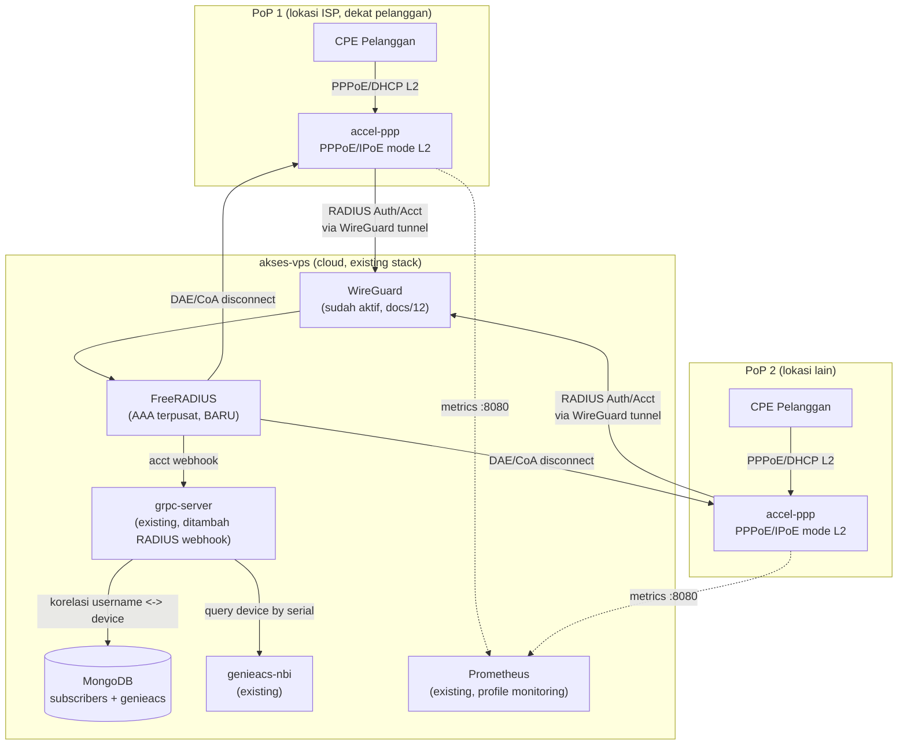

# 13 — Integrasi accel-ppp (BNG/Access Concentrator)

## Kenapa accel-ppp Berbeda dari Service Lain di Stack Ini

Semua service di `docker-compose.reference.yml` (nginx, grpc-server, GenieACS, dst)
adalah aplikasi stateless/HTTP yang cocok jalan di cloud VPS mana saja. **accel-ppp
tidak masuk kategori itu** — dia adalah *access concentrator* (BNG) yang untuk
PPPoE/IPoE mode L2 butuh **adjacency Layer-2 langsung ke pelanggan** (broadcast
domain yang sama dengan CPE/ONU/DSLAM). Cloud VPS multi-tenant seperti IDCloudHost
**tidak punya** L2 adjacency ke pelanggan riil — jadi accel-ppp untuk PPPoE/IPoE
**tidak dipasang di `akses-vps` cloud stack**, melainkan di **PoP (Point of
Presence) milik ISP**, colocated dengan OLT/DSLAM/access switch.

Yang **bisa** dan **memang seharusnya** ada di cloud (`akses-vps`) adalah:
1. **FreeRADIUS** sebagai AAA server terpusat — satu sumber kebenaran untuk semua PoP.
2. **Korelasi data pelanggan ↔ perangkat** (subscriber RADIUS username ↔ device GenieACS).
3. Opsional: accel-ppp mode **L2TP/SSTP/PPTP** di cloud untuk remote-access VPN
   (protokol ini murni routed-IP, tidak butuh L2 adjacency, jadi valid dijalankan
   di VPS biasa — beda dengan PPPoE/IPoE).

## Arsitektur Dua Tingkat



**Kenapa lewat WireGuard yang sudah ada?** RADIUS protokol asli hanya diamankan
`shared secret` di atas UDP polos — rawan spoofing/replay kalau lewat internet
terbuka. Dengan menumpangkan trafik RADIUS PoP→Cloud di atas tunnel WireGuard
yang sudah kita bangun (`docs/12-wireguard-vpn.md`), FreeRADIUS di cloud **tidak
perlu expose port 1812/1813 ke publik sama sekali** — cukup bind ke IP WireGuard
(`10.66.66.1`), dan setiap PoP baru tinggal ditambahkan sebagai WireGuard peer.

## Komponen Baru di `docker-compose.reference.yml`

```yaml
  freeradius:
    image: freeradius/freeradius-server:3.2
    restart: unless-stopped
    network_mode: "host"   # perlu bind persis ke IP wg0 (10.66.66.1), bukan Docker bridge
    volumes:
      - ./freeradius/raddb:/etc/raddb:ro
      - ./freeradius/certs:/etc/raddb/certs:ro
    environment:
      - RUN_MODE=debug   # ganti ke default di production untuk logging lebih ringkas
    depends_on: [mongodb]
```

> `network_mode: host` dipakai supaya FreeRADIUS bisa listen tepat di
> `10.66.66.1:1812/1813` (interface WireGuard), bukan di IP internal Docker
> bridge yang tidak reachable dari PoP. Ini satu-satunya service di stack yang
> perlu host networking — semua service lain tetap terisolasi seperti biasa.

## Konfigurasi FreeRADIUS (`freeradius/raddb/`)

**`clients.conf`** — satu entri per PoP, dibatasi ke IP WireGuard masing-masing
(bukan `0.0.0.0/0`):

```
client pop1 {
    ipaddr     = 10.66.66.10
    secret     = <secret-unik-per-pop>
    require_message_authenticator = yes
}
client pop2 {
    ipaddr     = 10.66.66.11
    secret     = <secret-unik-per-pop>
    require_message_authenticator = yes
}
```

**`mods-available/sql`** — backend PostgreSQL standar FreeRADIUS (schema
`radcheck`/`radreply`/`radacct`/`radpostauth`, sudah teruji untuk skala ISP,
lebih cocok dari MongoDB untuk kebutuhan `rlm_sql` bawaan). Tambahkan service
`radius-db` (Postgres) khusus untuk ini — dipisah dari `mongodb` yang tetap
jadi database GenieACS:

```yaml
  radius-db:
    image: postgres:16-alpine
    restart: unless-stopped
    networks: [data-net]
    environment:
      POSTGRES_DB: radius
      POSTGRES_USER: radius
      POSTGRES_PASSWORD: ${RADIUS_DB_PASSWORD}
    volumes:
      - radius-db-data:/var/lib/postgresql/data
```

**DAE/CoA** (untuk disconnect paksa dari cloud, mis. dipicu kondisi di GenieACS):

```
# raddb/sites-available/dynamic-authorization di FreeRADIUS (client) TIDAK relevan —
# yang relevan adalah accel-ppp.conf di sisi PoP:
[radius]
dae-server=10.66.66.1:3799,<secret>
dae-allowed=10.66.66.1/32
```

## Konfigurasi accel-ppp di Sisi PoP (referensi, dijalankan di server PoP)

```ini
[radius]
nas-identifier=pop1
nas-ip-address=<ip-lokal-pop>
gw-ip-address=<gateway-subscriber-pool>
server=10.66.66.1,<secret-pop1>,auth-port=1812,acct-port=1813
dae-server=10.66.66.1:3799,<secret-pop1>
dae-allowed=10.66.66.1/32
blast-protection=1

[pppoe]
interface=<nic-menghadap-subscriber>
ac-name=isp-pop1
tr101=1

[metrics]
format=prometheus
address=127.0.0.1:8080
allowed_ips=["10.66.66.1/32"]
```

`gw-ip-address` PoP TIDAK boleh 0.0.0.0/publik — WireGuard peer PoP wajib
ditambahkan dulu di `wg0.conf` cloud (pola sama seperti menambah client baru,
lihat `docs/12-wireguard-vpn.md`), lalu `allowed-ips` peer itu diarahkan ke IP
lokal PoP supaya trafik RADIUS/DAE/metrics bisa lewat tunnel.

## Korelasi Subscriber ↔ Device GenieACS

Ditambahkan collection baru di MongoDB yang **sudah ada** (`genieacs` db, bukan
db radius):

```js
// db.subscriber_links
{
  _id: "radius-username-atau-pppoe-account-id",
  device_id: "OUI-SerialNumber",       // cocokkan dengan _id di collection devices GenieACS
  pop: "pop1",
  linked_at: ISODate(),
  status: "active"
}
```

Alur pengisian: FreeRADIUS `rlm_rest` module memanggil webhook di `grpc-server`
setiap `Accounting-Start`/`Accounting-Stop` (endpoint baru, mis.
`POST /v1/radius/accounting`), `grpc-server` mem-parsing `Framed-IP-Address` +
`Calling-Station-ID` (biasanya MAC CPE), mencocokkan ke `devices._deviceId._SerialNumber`
di GenieACS, lalu upsert ke `subscriber_links`. Endpoint ini didaftarkan sebagai
RPC baru `LinkSubscriberSession` di `proto/device.proto` (proto sudah dirancang
extensible untuk ini — lihat `grpc-server/proto/device.proto`).

Manfaat langsung: dashboard operasional bisa jawab "pelanggan username X lagi
online dari PoP mana, pakai IP berapa, dan CPE-nya (serial berapa) rewel apa
enggak menurut GenieACS" — dalam satu query, bukan cek dua sistem terpisah.

## Monitoring

Tambahkan job scrape baru di `monitoring/prometheus/prometheus.yml` (contoh,
sesuaikan jumlah PoP sungguhan):

```yaml
  - job_name: "accel-ppp-pop1"
    static_configs:
      - targets: ["10.66.66.10:8080"]
  - job_name: "accel-ppp-pop2"
    static_configs:
      - targets: ["10.66.66.11:8080"]
  - job_name: "freeradius"
    static_configs:
      - targets: ["127.0.0.1:9812"]   # radsniff/statsd exporter, atau parsing radacct via postgres_exporter
```

Karena target berada di belakang WireGuard, Prometheus (yang jalan di `obs-net`
Docker network) perlu rute ke `10.66.66.0/24` — cukup jalankan Prometheus juga
dengan akses ke interface host (atau route lewat `network_mode: host` seperti
FreeRADIUS, tergantung berapa banyak service lain yang butuh akses serupa).

## Keamanan Tambahan Khusus Modul Ini

- Secret RADIUS **unik per PoP** — kompromi satu PoP tidak membuka semua.
- `dae-allowed` di setiap accel-ppp PoP dibatasi ketat ke IP WireGuard `10.66.66.1` saja.
- FreeRADIUS `require_message_authenticator = yes` di semua client — mitigasi Blast RADIUS.
- `radius-db` (Postgres) di `data-net` (internal-only), sama seperti `mongodb`/`redis` — tidak pernah ada rute ke internet.
- CLI/telnet accel-ppp di PoP dibatasi `127.0.0.1` saja (default aman), akses jarak jauh untuk debug lewat SSH+WireGuard, bukan expose telnet.

## Status Implementasi

- [x] **RPC `LinkSubscriberSession`** — sudah diimplementasi penuh di `grpc-server`
  (`internal/store/mongo.go`), termasuk pencarian device by MAC (dengan fallback
  beberapa path TR-098/TR-181, plus Virtual Parameter seragam
  `genieacs/examples/virtual-parameter-mac-address.js`) dan upsert ke koleksi
  `subscriber_links`. **Sudah diuji end-to-end** di AKSES-VPS: MAC cocok →
  `linked=true` + `device_id` terisi; MAC tidak cocok → `linked=false`; kedua
  kasus ter-upsert benar ke MongoDB (`$setOnInsert` untuk `linked_at`, `$set`
  untuk field lain).
- [x] Role MongoDB least-privilege `grpcServerRole` (find `devices`,
  find/insert/update `subscriber_links` saja) — diterapkan baik di
  `mongodb/init/01-create-users.js` (deployment baru) maupun live di instance
  yang sedang jalan.
- [x] Endpoint `POST /v1/radius/accounting` (REST) untuk dipanggil `rlm_rest`
  FreeRADIUS — diimplementasi sebagai wrapper tipis di atas RPC
  `LinkSubscriberSession` yang sudah ada (`internal/server/http_radius_accounting.go`),
  bukan implementasi terpisah/gRPC-Gateway. Body request/response persis sama
  dengan field proto (`radius_username`, `calling_station_id`,
  `framed_ip_address`, `pop`, `event_type` / `linked`, `device_id`) karena
  struct Go hasil generate proto sudah punya `json:` tag yang cocok. Auth
  pakai header `X-Internal-Api-Key` (`INTERNAL_API_KEY`), sama seperti jalur
  gRPC internal (lihat `internal/middleware/auth.go`). Diverifikasi live:
  401 tanpa/salah API key, 400 kalau field wajib kosong, 405 kalau bukan
  POST, 200 + upsert `subscriber_links` yang benar untuk request valid
  (dites lewat curl dari container lain di `app-net`, bukan cuma dari
  grpc-server sendiri).
- [x] **`rlm_rest` FreeRADIUS benar-benar terhubung ke endpoint di atas** —
  instance module baru `mods-available/rest_radius_accounting` (bukan edit
  `mods-available/rest` yang generic), di-hook ke `accounting {}` di
  `sites-available/default` dengan prefix `-` (kegagalan webhook tidak
  memblokir Accounting-Response ke NAS). `freeradius` ditambahkan ke
  `app-net` (dulu cuma `radius-net`, terisolasi dari grpc-server) supaya
  bisa resolve `grpc-server` via Docker DNS. Dua bug nyata ketemu & fix
  sebelum ini jalan:
  1. `pool.start`/`pool.min` module `rest` defaultnya bukan 0 — kalau
     dibiarkan, freeradius **menolak start sama sekali** kalau grpc-server
     belum reachable saat boot (kelas bug yang sama dengan race
     grpc-server<->mongo yang sudah diperbaiki sebelumnya). Set ke 0 +
     tidak set `connect_uri` top-level (yang punya pre-flight reachability
     check sendiri) supaya koneksi dibuka lazy saat request pertama.
  2. Xlat untuk baca environment variable (`INTERNAL_API_KEY` buat header
     `X-Internal-Api-Key`) - dua sintaks yang saya kira benar ternyata
     salah, dites langsung lewat `radiusd -X`: `%{env:...}` → parse error
     "Unknown module"; `%env(...)` → diam-diam expand jadi string sampah
     (`%e` ternyata legacy single-char escape, bukan function call). Yang
     benar-benar jalan: `$ENV{...}` (mekanisme conf-file-parse-time yang
     sama seperti `mods-available/sql`'s password field), dipakai di dalam
     blok `update control {}`.
  Diverifikasi end-to-end **sungguhan** (bukan cuma curl manual ke
  grpc-server): `radclient` mensimulasikan Accounting-Start dan -Stop
  asli dari accel-ppp lewat `10.66.66.1:1813`, lolos FreeRADIUS penuh
  (SQL logging + webhook), grpc-server menerima dengan `X-Internal-Api-Key`
  yang benar (200 OK), `subscriber_links` di MongoDB ter-upsert dengan
  `status` yang benar (`active` untuk Start, `disconnected` untuk Stop —
  ini juga membuktikan fix case-sensitivity `event_type` di grpc-server
  bekerja terhadap value asli FreeRADIUS: `%{Acct-Status-Type}` expand ke
  `"Start"`/`"Stop"` dengan huruf besar, bukan huruf kecil). Dites baik di
  instance debug (`freeradius -X`) maupun di container produksi yang
  sebenarnya jalan.
- [ ] Build image Docker accel-ppp (mode L2TP/SSTP cloud-deployable — PPPoE/IPoE tetap bare-metal di PoP).
- [x] `freeradius/raddb/` lengkap (default tree penuh dari image resmi + `mods-enabled/sql`
  aktif ke Postgres `radius-db`) dan schema Postgres `radacct`/`radcheck`/`radreply`/dst
  ter-load — dideploy dan diverifikasi live dengan `radtest`/`radclient` (Access-Accept/
  Reject + accounting keduanya round-trip lewat Postgres dengan benar).
- [x] Tambah WireGuard peer untuk PoP pertama (2026-07-08) — `[Peer]` block untuk
  `pop1` (`AllowedIPs = 10.66.66.10/32`) sudah ditambahkan ke `wg0.conf` server dan
  di-reload tanpa downtime (`wg syncconf`, tidak mengganggu peer `client1` yang
  sudah ada). `freeradius/raddb/clients.conf`'s `pop1` sudah pakai secret RADIUS asli
  (bukan `CHANGE_ME_PER_POP_SECRET` lagi). **Private key WireGuard + secret RADIUS
  keduanya SENGAJA tidak disimpan di repo maupun tertinggal di VPS** setelah dibuat,
  sesuai `docs/12` — hanya public key yang ada di `wg0.conf` (yang bukan rahasia).
  Bundle setup (`pop1.conf` buat box PoP + potongan config `[radius]`/`[pppoe]`
  accel-ppp) sudah disiapkan terpisah di luar repo untuk operator PoP 1 pakai
  langsung, dengan instruksi cara reset kalau perlu regenerasi.
  **Catatan**: pipa lengkap PoP→cloud (accel-ppp→FreeRADIUS→grpc-server→MongoDB)
  sekarang sudah terbukti berfungsi sampai ke FreeRADIUS, dan slot koneksi PoP 1 di
  sisi server (WireGuard peer + RADIUS client) sudah siap. Yang tersisa murni
  menyiapkan **hardware PoP 1 sungguhan** (accel-ppp terpasang, isi
  `nas-ip-address`/`gw-ip-address`/`interface` sesuai topologi riil PoP 1) dan
  menyambungkannya pakai bundle di atas — bukan lagi soal kelengkapan software
  di cloud sama sekali.
