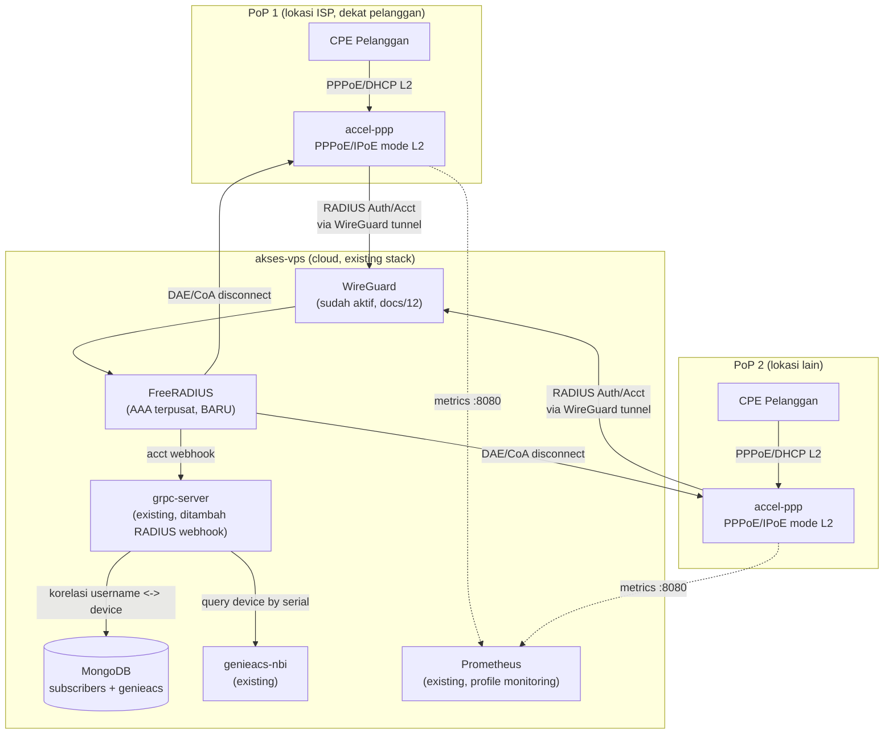

# 13 — Integrasi accel-ppp (BNG/Access Concentrator)

## Kenapa accel-ppp Berbeda dari Service Lain di Stack Ini

Semua service di `docker-compose.reference.yml` (nginx, grpc-server, GenieACS, dst)
adalah aplikasi stateless/HTTP yang cocok jalan di cloud VPS mana saja. **accel-ppp
tidak masuk kategori itu** — dia adalah *access concentrator* (BNG) yang untuk
PPPoE/IPoE mode L2 butuh **adjacency Layer-2 langsung ke pelanggan** (broadcast
domain yang sama dengan CPE/ONU/DSLAM). Cloud VPS multi-tenant seperti IDCloudHost
**tidak punya** L2 adjacency ke pelanggan riil — jadi accel-ppp untuk PPPoE/IPoE
**tidak dipasang di `akses-vps` cloud stack**, melainkan di **PoP (Point of
Presence) milik ISP**, colocated dengan OLT/DSLAM/access switch.

Yang **bisa** dan **memang seharusnya** ada di cloud (`akses-vps`) adalah:
1. **FreeRADIUS** sebagai AAA server terpusat — satu sumber kebenaran untuk semua PoP.
2. **Korelasi data pelanggan ↔ perangkat** (subscriber RADIUS username ↔ device GenieACS).
3. Opsional: accel-ppp mode **L2TP/SSTP/PPTP** di cloud untuk remote-access VPN
   (protokol ini murni routed-IP, tidak butuh L2 adjacency, jadi valid dijalankan
   di VPS biasa — beda dengan PPPoE/IPoE).

## Arsitektur Dua Tingkat



**Kenapa lewat WireGuard yang sudah ada?** RADIUS protokol asli hanya diamankan
`shared secret` di atas UDP polos — rawan spoofing/replay kalau lewat internet
terbuka. Dengan menumpangkan trafik RADIUS PoP→Cloud di atas tunnel WireGuard
yang sudah kita bangun (`docs/12-wireguard-vpn.md`), FreeRADIUS di cloud **tidak
perlu expose port 1812/1813 ke publik sama sekali** — cukup bind ke IP WireGuard
(`10.66.66.1`), dan setiap PoP baru tinggal ditambahkan sebagai WireGuard peer.

## Komponen Baru di `docker-compose.reference.yml`

```yaml
  freeradius:
    image: freeradius/freeradius-server:3.2
    restart: unless-stopped
    network_mode: "host"   # perlu bind persis ke IP wg0 (10.66.66.1), bukan Docker bridge
    volumes:
      - ./freeradius/raddb:/etc/raddb:ro
      - ./freeradius/certs:/etc/raddb/certs:ro
    environment:
      - RUN_MODE=debug   # ganti ke default di production untuk logging lebih ringkas
    depends_on: [mongodb]
```

> `network_mode: host` dipakai supaya FreeRADIUS bisa listen tepat di
> `10.66.66.1:1812/1813` (interface WireGuard), bukan di IP internal Docker
> bridge yang tidak reachable dari PoP. Ini satu-satunya service di stack yang
> perlu host networking — semua service lain tetap terisolasi seperti biasa.

## Konfigurasi FreeRADIUS (`freeradius/raddb/`)

**`clients.conf`** — satu entri per PoP, dibatasi ke IP WireGuard masing-masing
(bukan `0.0.0.0/0`):

```
client pop1 {
    ipaddr     = 10.66.66.10
    secret     = <secret-unik-per-pop>
    require_message_authenticator = yes
}
client pop2 {
    ipaddr     = 10.66.66.11
    secret     = <secret-unik-per-pop>
    require_message_authenticator = yes
}
```

**`mods-available/sql`** — backend PostgreSQL standar FreeRADIUS (schema
`radcheck`/`radreply`/`radacct`/`radpostauth`, sudah teruji untuk skala ISP,
lebih cocok dari MongoDB untuk kebutuhan `rlm_sql` bawaan). Tambahkan service
`radius-db` (Postgres) khusus untuk ini — dipisah dari `mongodb` yang tetap
jadi database GenieACS:

```yaml
  radius-db:
    image: postgres:16-alpine
    restart: unless-stopped
    networks: [data-net]
    environment:
      POSTGRES_DB: radius
      POSTGRES_USER: radius
      POSTGRES_PASSWORD: ${RADIUS_DB_PASSWORD}
    volumes:
      - radius-db-data:/var/lib/postgresql/data
```

**DAE/CoA** (untuk disconnect paksa dari cloud, mis. dipicu kondisi di GenieACS):

```
# raddb/sites-available/dynamic-authorization di FreeRADIUS (client) TIDAK relevan —
# yang relevan adalah accel-ppp.conf di sisi PoP:
[radius]
dae-server=10.66.66.1:3799,<secret>
dae-allowed=10.66.66.1/32
```

## Konfigurasi accel-ppp di Sisi PoP (referensi, dijalankan di server PoP)

```ini
[radius]
nas-identifier=pop1
nas-ip-address=<ip-lokal-pop>
gw-ip-address=<gateway-subscriber-pool>
server=10.66.66.1,<secret-pop1>,auth-port=1812,acct-port=1813
dae-server=10.66.66.1:3799,<secret-pop1>
dae-allowed=10.66.66.1/32
blast-protection=1

[pppoe]
interface=<nic-menghadap-subscriber>
ac-name=isp-pop1
tr101=1

[metrics]
format=prometheus
address=127.0.0.1:8080
allowed_ips=["10.66.66.1/32"]
```

`gw-ip-address` PoP TIDAK boleh 0.0.0.0/publik — WireGuard peer PoP wajib
ditambahkan dulu di `wg0.conf` cloud (pola sama seperti menambah client baru,
lihat `docs/12-wireguard-vpn.md`), lalu `allowed-ips` peer itu diarahkan ke IP
lokal PoP supaya trafik RADIUS/DAE/metrics bisa lewat tunnel.

## Korelasi Subscriber ↔ Device GenieACS

Ditambahkan collection baru di MongoDB yang **sudah ada** (`genieacs` db, bukan
db radius):

```js
// db.subscriber_links
{
  _id: "radius-username-atau-pppoe-account-id",
  device_id: "OUI-SerialNumber",       // cocokkan dengan _id di collection devices GenieACS
  pop: "pop1",
  linked_at: ISODate(),
  status: "active"
}
```

Alur pengisian: FreeRADIUS `rlm_rest` module memanggil webhook di `grpc-server`
setiap `Accounting-Start`/`Accounting-Stop` (endpoint baru, mis.
`POST /v1/radius/accounting`), `grpc-server` mem-parsing `Framed-IP-Address` +
`Calling-Station-ID` (biasanya MAC CPE), mencocokkan ke `devices._deviceId._SerialNumber`
di GenieACS, lalu upsert ke `subscriber_links`. Endpoint ini didaftarkan sebagai
RPC baru `LinkSubscriberSession` di `proto/device.proto` (proto sudah dirancang
extensible untuk ini — lihat `grpc-server/proto/device.proto`).

Manfaat langsung: dashboard operasional bisa jawab "pelanggan username X lagi
online dari PoP mana, pakai IP berapa, dan CPE-nya (serial berapa) rewel apa
enggak menurut GenieACS" — dalam satu query, bukan cek dua sistem terpisah.

## Monitoring

Tambahkan job scrape baru di `monitoring/prometheus/prometheus.yml` (contoh,
sesuaikan jumlah PoP sungguhan):

```yaml
  - job_name: "accel-ppp-pop1"
    static_configs:
      - targets: ["10.66.66.10:8080"]
  - job_name: "accel-ppp-pop2"
    static_configs:
      - targets: ["10.66.66.11:8080"]
  - job_name: "freeradius"
    static_configs:
      - targets: ["127.0.0.1:9812"]   # radsniff/statsd exporter, atau parsing radacct via postgres_exporter
```

Karena target berada di belakang WireGuard, Prometheus (yang jalan di `obs-net`
Docker network) perlu rute ke `10.66.66.0/24` — cukup jalankan Prometheus juga
dengan akses ke interface host (atau route lewat `network_mode: host` seperti
FreeRADIUS, tergantung berapa banyak service lain yang butuh akses serupa).

## Keamanan Tambahan Khusus Modul Ini

- Secret RADIUS **unik per PoP** — kompromi satu PoP tidak membuka semua.
- `dae-allowed` di setiap accel-ppp PoP dibatasi ketat ke IP WireGuard `10.66.66.1` saja.
- FreeRADIUS `require_message_authenticator = yes` di semua client — mitigasi Blast RADIUS.
- `radius-db` (Postgres) di `data-net` (internal-only), sama seperti `mongodb`/`redis` — tidak pernah ada rute ke internet.
- CLI/telnet accel-ppp di PoP dibatasi `127.0.0.1` saja (default aman), akses jarak jauh untuk debug lewat SSH+WireGuard, bukan expose telnet.

## Status Implementasi

- [x] **RPC `LinkSubscriberSession`** — sudah diimplementasi penuh di `grpc-server`
  (`internal/store/mongo.go`), termasuk pencarian device by MAC (dengan fallback
  beberapa path TR-098/TR-181, plus Virtual Parameter seragam
  `genieacs/examples/virtual-parameter-mac-address.js`) dan upsert ke koleksi
  `subscriber_links`. **Sudah diuji end-to-end** di AKSES-VPS: MAC cocok →
  `linked=true` + `device_id` terisi; MAC tidak cocok → `linked=false`; kedua
  kasus ter-upsert benar ke MongoDB (`$setOnInsert` untuk `linked_at`, `$set`
  untuk field lain).
- [x] Role MongoDB least-privilege `grpcServerRole` (find `devices`,
  find/insert/update `subscriber_links` saja) — diterapkan baik di
  `mongodb/init/01-create-users.js` (deployment baru) maupun live di instance
  yang sedang jalan.
- [ ] Endpoint `POST /v1/radius/accounting` (REST) untuk dipanggil `rlm_rest`
  FreeRADIUS — saat ini baru RPC gRPC native yang sudah bisa dipanggil
  (via gRPC-Gateway jika perlu REST, lihat `nginx/conf.d/api.domain.com.conf`).
- [ ] Build image Docker accel-ppp (mode L2TP/SSTP cloud-deployable — PPPoE/IPoE tetap bare-metal di PoP).
- [ ] Tulis `freeradius/raddb/` lengkap (saat ini baru cuplikan `clients.conf`) dan schema Postgres `radacct`.
- [ ] Tambah WireGuard peer untuk PoP pertama begitu ada PoP sungguhan untuk dites end-to-end.
