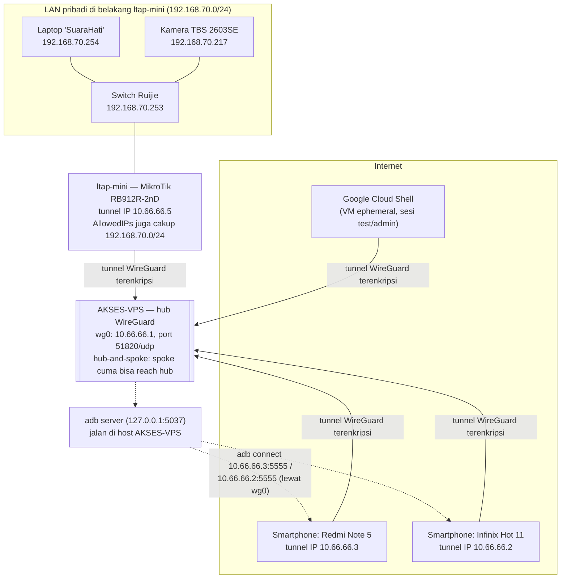
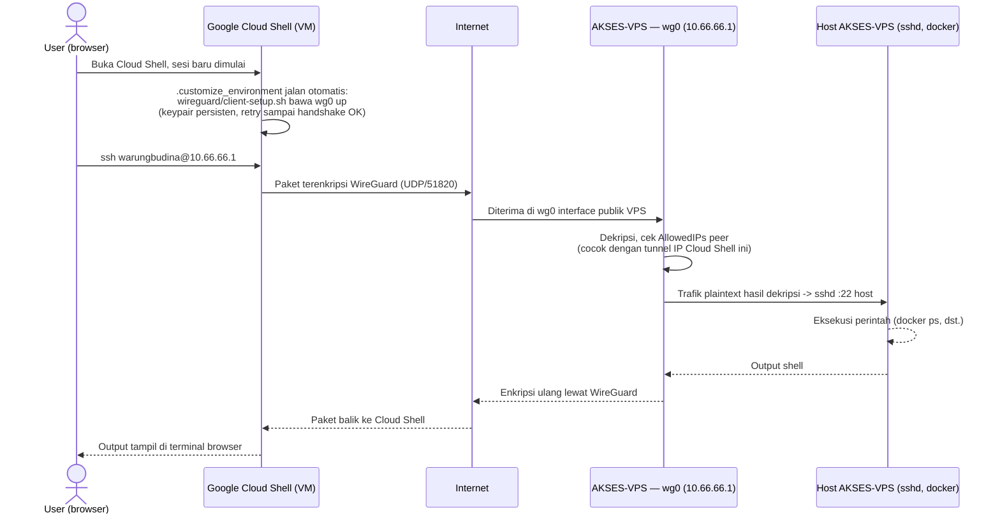
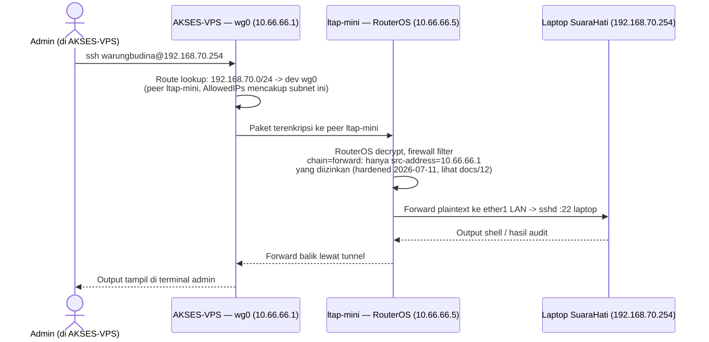
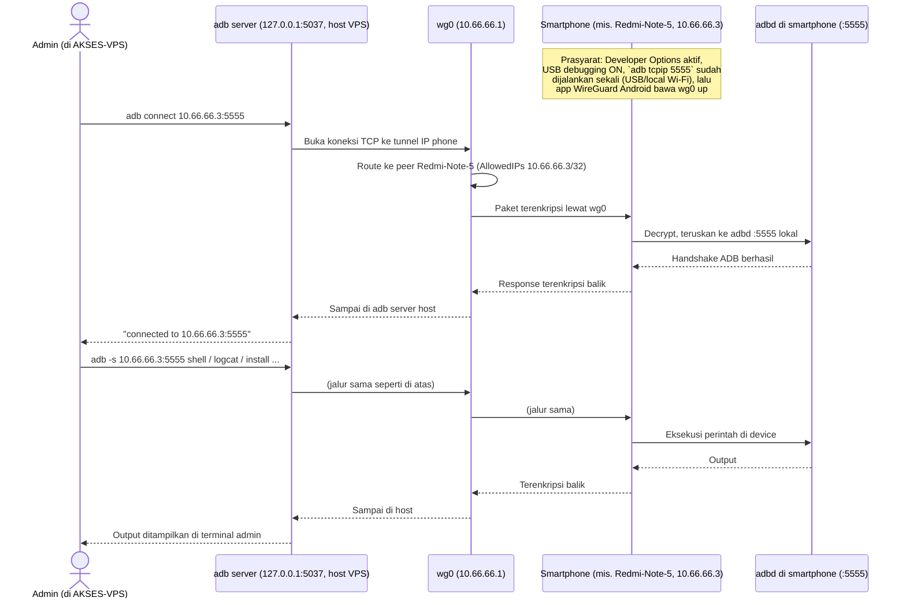

# 15 — Alur Akses End-to-End: Cloud Shell / Laptop / Smartphone lewat WireGuard

## Kenapa dokumen ini ada

`docs/12-wireguard-vpn.md` menjelaskan **konfigurasi** WireGuard (siapa saja
peer-nya, cara tambah/hapus). Dokumen ini melengkapi dengan **alur trafik
konkret** — dari perangkat user, lewat tunnel, sampai ke tujuan, dan
kembali lagi ke user — untuk tiga jenis endpoint yang benar-benar dipakai
saat ini: **Google Cloud Shell**, **Laptop/LAN di belakang `ltap-mini`**,
dan **Smartphone (ADB)**.

## WireGuard bukan jalur GenieACS/subscriber — penting dipahami dulu

Stack ini punya **dua jalur masuk yang terpisah total**, jangan tertukar:

| Jalur | Dipakai untuk | Contoh domain/port |
|---|---|---|
| **Cloudflare Tunnel** (`cloudflared`) + **CWMP publik** (`nginx :7547`) | Trafik produksi: CPE TR-069, GenieACS UI, API gRPC | `acs.obc-crypto.com`, `cwmp.obc-crypto.com`, `api.obc-crypto.com`, `fs.obc-crypto.com` |
| **WireGuard** (`wg0`, `51820/udp`) | Akses **admin/privat**: masuk ke LAN pribadi di belakang `ltap-mini`, akses langsung ke host VPS, kontrol smartphone via ADB | `10.66.66.0/24` (hub-and-spoke, bukan mesh — lihat `docs/12`) |

`genieacs-ui`, `genieacs-nbi`, dll **tidak** di-reach lewat WireGuard —
mereka cuma reachable dari dalam jaringan Docker (`app-net`), diteruskan
nginx ke domain publik lewat Cloudflare Tunnel. WireGuard di dokumen ini
murni tentang jalur kedua di atas.

## Topologi keseluruhan



Catatan topologi (detail lengkap di `docs/12`):
- **Hub-and-spoke** — tiap spoke (`Cloud Shell`, `Redmi-Note-5`,
  `Infinix-Hot-11`) cuma bisa reach `10.66.66.1` (hub), tidak bisa saling
  reach satu sama lain.
- **`ltap-mini` adalah satu-satunya spoke dengan `AllowedIPs` berupa subnet**
  (`192.168.70.0/24`), bukan cuma `/32` — karena dia bertindak sebagai
  gateway/router untuk LAN pribadi di baliknya, bukan endpoint tunggal.

## Alur 1 — Google Cloud Shell: akses admin ke host AKSES-VPS

Skenario: developer/admin buka Google Cloud Shell dari browser, mau
menjalankan perintah administratif langsung di VPS (mis. `docker ps`, cek
log) lewat jalur privat, bukan lewat SSH publik `:22` biasa.



Catatan realistis: sesi Cloud Shell **reset ~20 menit setelah sesi
berakhir** — makanya keypair WireGuard-nya harus persisten lewat
`.customize_environment` (bukan generate ulang tiap sesi), seperti dicatat
di `docs/12`.

## Alur 2 — Laptop/kamera di LAN `ltap-mini`: audit perangkat privat

Skenario: admin perlu SSH ke laptop `SuaraHati` (atau device lain) di LAN
`192.168.70.0/24` yang **tidak reachable dari internet sama sekali** —
satu-satunya jalur masuk adalah lewat hub WireGuard, diteruskan RouterOS di
`ltap-mini`.



Variasi yang sama juga berlaku untuk mengakses **kamera TBS 2603SE**
(`192.168.70.217`, protokol RTSP/HTTP RPC alih-alih SSH) — jalur
enkripsi/forwarding-nya identik, cuma port dan protokol tujuan yang beda.

Catatan penting (sudah dicatat di `docs/12`): RouterOS **tidak otomatis**
menambahkan route balik untuk `AllowedIPs` seperti `wg-quick` di Linux —
`ltap-mini` butuh `/ip route add dst-address=10.66.66.1/32 gateway=wg-akses-vps`
manual supaya arah baliknya (LAN → hub) juga jalan, bukan cuma
handshake/keepalive.

## Alur 3 — Smartphone: kontrol/audit via ADB lewat tunnel

Skenario: admin ingin menjalankan `adb shell`/`adb logcat`/dsb. ke
smartphone (`Redmi-Note-5` atau `Infinix-Hot-11`) yang terhubung sebagai
spoke WireGuard, dari AKSES-VPS langsung — tanpa laptop perantara.



Catatan keamanan (sudah dicek saat setup, lihat `wireguard/install-adb-tools.sh`):
`adb server` bind ke `127.0.0.1:5037` saja — **tidak** membuka port ke
jaringan manapun. Yang membawa trafik ke smartphone adalah `adb connect`
memakai tunnel IP `10.66.66.x` yang sudah terenkripsi WireGuard, bukan ADB
network mode yang di-expose langsung ke internet.

## Ringkasan pola umum (berlaku di ketiga alur)

Setiap alur di atas mengikuti pola yang sama, cuma beda titik awal/akhir:

```
User (di titik manapun)
  -> aplikasi lokal (browser/SSH/adb client)
  -> WireGuard encrypt (di sisi pengirim)
  -> Internet (UDP 51820, opaque - isi paket tidak terbaca)
  -> WireGuard decrypt (di hub AKSES-VPS ATAU di ltap-mini untuk trafik LAN)
  -> service tujuan (sshd / adbd / RouterOS forward)
  -> response mengikuti jalur yang sama terbalik
  -> kembali ke User
```

Referensi terkait: `docs/12-wireguard-vpn.md` (konfigurasi peer & hardening),
`docs/02-network-diagram.md` (diagram jaringan keseluruhan termasuk jalur
Cloudflare Tunnel/CWMP yang terpisah dari WireGuard).
